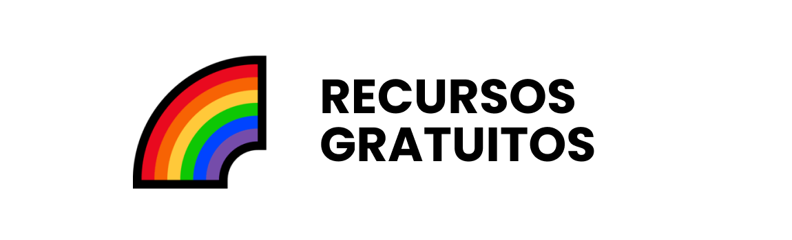
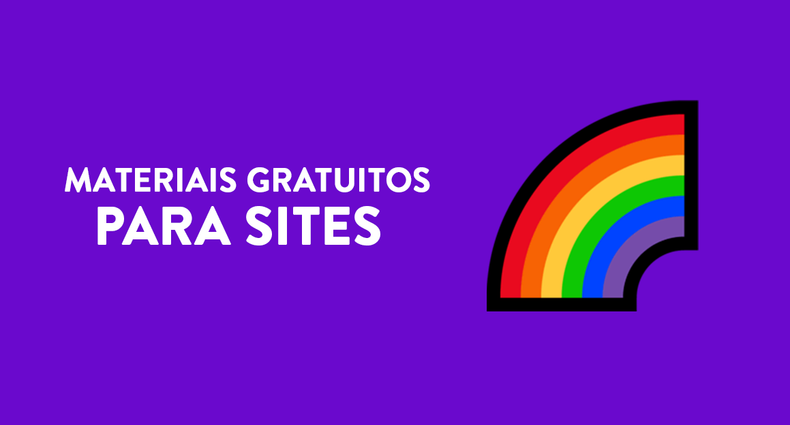
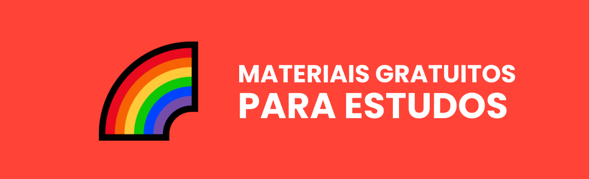
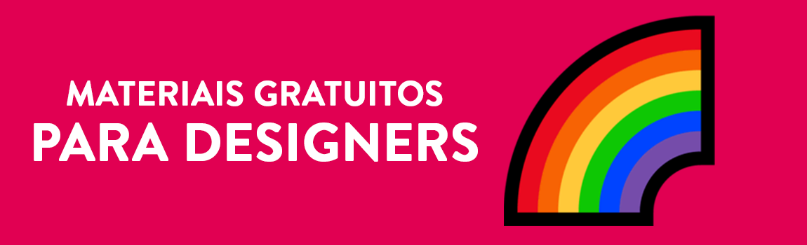

<h1 align="center">
  
</h1>

#### Switch to english: <kbd></kbd>

#### Cambiar al español: <kbd></kbd>

#### 切換到英文: <kbd></kbd>

> Uma coisa que eu sempre fico em dúvida na hora de desenvolver ou aprender a fazer meus sites é sempre a mesma: <i>Quais recursos usar no projeto e onde encontrá-los?</i>
> Então, com essa dúvida criei esse repositório como resposta, mais do que apenas um monte de links, esta é uma seleção do que julgamos ser algumas das melhores oportunidades de aprendizado que você encontrará online gratuitamente.

## 📚 Índice

🔖 [Imagens](pages/materiais-gratuitos-para-sites.br.md#-imagens) 
🔖 [Ilustrações e Vetores](pages/materiais-gratuitos-para-sites.br.md#-ilustrações-e-vetores) 
🔖 [Emojis](pages/materiais-gratuitos-para-sites.br.md#-emojis) 
🔖 [Paletas de Cores](pages/materiais-gratuitos-para-sites.br.md#-paletas-de-cores) 
🔖 [Fontes e Fontes de ícones](pages/materiais-gratuitos-para-sites.br.md#-fontes-e-fontes-de-ícones) 
🔖 [Ícones](pages/materiais-gratuitos-para-sites.br.md#-ícones) 
🔖 [Animações e Gifs](pages/materiais-gratuitos-para-sites.br.md#-animações-e-gifs) 
🔖 [Logos](pages/materiais-gratuitos-para-sites.br.md#-logos) 

---

## 📚 Índice

🔖 [Livros](pages/materiais-gratuitos-para-estudos.br.md#-livros) 
🔖 [Cursos](pages/materiais-gratuitos-para-estudos.br.md#-cursos) 
🔖 [Podcasts](pages/materiais-gratuitos-para-estudos.br.md#-podcasts) 
🔖 [Sites e Blogs](pages/materiais-gratuitos-para-estudos.br.md#-sites-e-blogs) 

---

## 📚 Índice

🔖 [Ferramentas de desenvolvimento](pages/materiais-gratuitos-para-devs.br.md#-ferramentas-de-desenvolvimento) 
🔖 [IDEs e editores de código](pages/materiais-gratuitos-para-devs.br.md#-ides-e-editores-de-código) 
🔖 [Linguagens de programação](pages/materiais-gratuitos-para-devs.br.md#-linguagens-de-programação) 
🔖 [Hospedagem](pages/materiais-gratuitos-para-devs.br.md#-hospedagem) 

---

## 📚 Índice

🔖 [Ferramentas](pages/materiais-gratuitos-para-designers.br.md#-ferramentas) 

---

## ☕ Seja um dos contribuidores

Quer fazer parte desse projeto? Clique [AQUI](CONTRIBUTING.md) e leia como contribuir. 

## 🍜 Licença

Esse projeto está sob licença. Veja o arquivo [LICENÇA](LICENSE.md) para mais detalhes. 

## 🦄 Contribuidores

<table>
  <tr>
    <td align="center">
      <a href="https://github.com/iuricode">
         
        
          <b>Iuri Silva</b>
        
      </a>
    </td>
    <td align="center">
      <a href="https://github.com/walysonfelipe">
         no GitHub"/> 
        
          <b><<!---->Waly></b>
        
      </a> 
    </td>
    <td align="center">
      <a href="https://github.com/joaomaranhao">
         
        
          <b>João Maranhão</b>
        
      </a> 
    </td>
    <td align="center">
      <a href="https://github.com/z3ox1s">
         
        
          <b>Carlos Daniel</b>
        
      </a> 
    </td>
    <td align="center">
      <a href="https://github.com/reness0">
         
        
          <b>Renê Júnior</b>
        
      </a> 
    </td>
    <td align="center">
      <a href="https://github.com/YasmimVieira">
         
        
          <b>Yasmim Vieira</b>
        
      </a> 
    </td>
  </tr>
</table>
