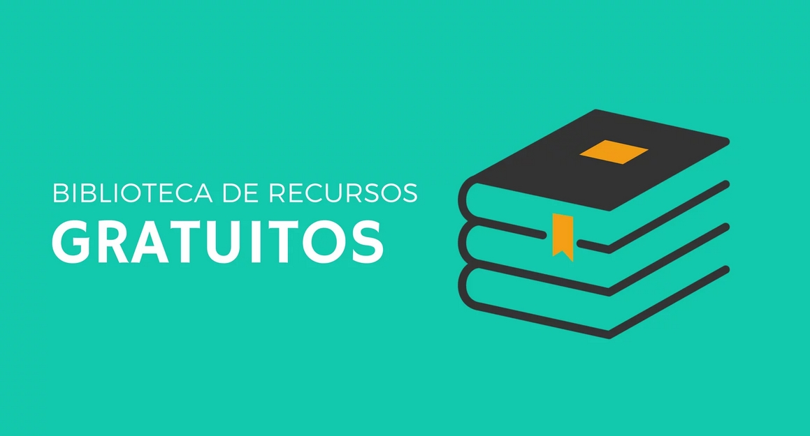

# 📌 Conteúdos gratuitos para sites

Uma coisa que sempre fico em dúvida na hora de desenvolver meus projetos é sempre as mesmas: 'Quais recursos de design usar no projeto e onde encontrá-los?'. 
Então, com essas perguntas eu criei este repositório como resposta.
Aqui nós temos tudo que um desenvolvedor precisa. Este repositório tem como objetivo listar conteúdos gratuitos, como livros, cursos, fontes, ilustrações, ícones, imagens, emojis, paleta de cores, animações, gifs e muito mais!

## 📕 Índice
- [Imagens](#-imagens)
- [Ilustrações e Vetores](#-ilustrações-e-vetores)
- [Emojis](#-emojis)
- [Cursos e Livros](#-cursos-e-livros)
- [Paletas de Cores](#-paletas-de-cores)
- [Fontes](#-fontes)
- [Ícones](#-ícones)
- [Animações e Gifs](#-animações-e-gifs)

## 🖼️ Imagens
[Wunderstock](https://wunderstock.com/)

[Pexels](https://www.pexels.com/pt-br/)

[Pixabay](https://pixabay.com/)

[freepik](https://www.freepik.com/popular-photos)

[unsplash](https://unsplash.com/)

[Behance](https://www.behance.net/galleries/illustration)

[freeimages](https://www.freeimages.com/pt) 

[iStock](https://www.istockphoto.com/) 

[StockSnap.io](https://stocksnap.io/)

[gratisgraphy](https://gratisography.com/)

[Pinterest](https://br.pinterest.com/)

[Burst](https://burst.shopify.com/free-images)

[StockFreeImages](https://www.stockfreeimages.com/)

[Freejpg](https://en.freejpg.com.ar/)

[shutterstock](https://www.shutterstock.com/pt/explore/royalty-free-images)

[Wunder Stock](https://wunderstock.com/)

## 🚀 Ilustrações e Vetores
[wannapik](https://www.wannapik.com/)

[facebook Design](https://facebook.design/)

[Ouch](https://icons8.com/illustrations)  

[DrawKit](https://www.drawkit.io/)  

[Sapiens](https://sapiens.ui8.net/)  

[Open Peeps](https://www.openpeeps.com/)  

[Growww](https://growwwkit.com/illustrations/phonies/)

[Illustrations](https://illlustrations.co/)  

[Vector Creator](https://icons8.com/vector-creator/) 

[Delesign](https://delesign.com/)  

[FreeVectors](https://www.freevectors.net/)

[Paper Illustrations](https://iconscout.com/paper-illustrations)  

[Whoosh! Illustration Kit](https://www.ls.graphics/illustrations/whoosh)  

[404 illustrations by kapwing](https://www.kapwing.com/404-illustrations)  

[Lukasadam](https://lukaszadam.com/illustrations)  

[Manypixels Illustration Gallery](https://www.manypixels.co/gallery/)  

[IRA Design](https://iradesign.io/)  

[Absurd Design](https://absurd.design/)  

[Humaaans](https://www.humaaans.com/)  

[Toy Faces](https://amritpaldesign.com/toy-faces)  

[Kukla Kit](https://www.kukla-kit.com/)  

[Construtor de Ilustrações](https://itg.digital/)  

[Ara Illustration](https://www.aracreator.com/)

[storytale.io](https://storytale.io/)  

[Black illustrations](https://www.blackillustrations.com/)  

[Flow Lava](https://flowlava.club/)  

[Control](https://control.rocks/)  

[Stories by Freepik](https://stories.freepik.com/)  

[Blush](https://blush.design/)  

[404 illustrations](https://error404.fun/)  

[Blob Marker](https://www.blobmaker.app/) 

[Scribbles](https://www.scribbbles.design/)  

[Get Waves](https://getwaves.io/)  

[Karthik Srinivas](https://www.karthiksrinivas.in/)  

[Design.ai](https://designs.ai/graphicmaker/) 

[Smash Illustrations](https://usesmash.com/)  

[Undraw](https://undraw.co/)  

[Open Doodles](https://www.opendoodles.com/)  

[Stubborn Generator](https://stubborn.fun/)  

[freellustrations](https://freellustrations.com/)  

[Fresh Folk](https://fresh-folk.com/)  

[Glaze](https://www.glazestock.com/)  

[Abstrakt](https://www.abstrakt.design/)

[Mixkit Art](https://mixkit.co/free-stock-art/)

[wannapik](https://www.wannapik.com/)

## 😛 Emojis
[EmojiCopy](https://www.emojicopy.com/)

[gitmoji](https://gitmoji.carloscuesta.me/)

[Get Emoji](https://getemoji.com/)

[Stories Freepik](https://stories.freepik.com/)

## 👨‍💻 Cursos e Livros

| Descrição      | Tipo (Curso, Livro, etc)           | Certificado | Idioma |
| -------------- | ---------------------------------- | ----------- | ------ |
| [4noobs](https://github.com/he4rt/4noobs) | Cursos | Não | PT-BR |
| [Amanda Vilela](https://www.youtube.com/channel/UCBHuWBJdB8HSh3_ZLwPq9_w) | Youtube | Não | PT-BR |
| [Balta.io](https://balta.io/cursos) | Cursos | Não | PT-BR |
| [Beginner’s Guide to React](https://egghead.io/courses/the-beginner-s-guide-to-react ) | Cursos | Não | EN |
| [Bora para prática!!!](https://www.youtube.com/user/boraparapratica/) | Youtube | Não | PT-BR |
| [BrazilJS](https://www.youtube.com/user/BrazilJS) | YouTube | Não | PT-BR |
| [Cabeça de Lab](https://www.cabecadelab.com.br/ ) | Podcast | Não | PT-BR |
| [CaveriaTech](https://www.youtube.com/user/caveiratech2) | Youtube | Não | PT-BR |
| [Caelum](https://www.caelum.com.br/apostilas) | Apostilas |Não| PT-BR |
| [CIJUN Academy](https://cijun.sp.gov.br/academy/) | Cursos | Sim | PT-BR |
| [Clojure for the Brave and True](https://www.braveclojure.com/) | Livro |Não| EN |
| [Cod3r Cursos](https://www.youtube.com/channel/UCcMcmtNSSQECjKsJA1XH5MQ) | YouTube | Não | PT-BR |
| [Codando](https://codando.org/material-gratuito/) | Cursos | Não | PT-BR |
| [Codecademy](https://www.codecademy.com/ ) | Cursos | Não | EN |
| [Code Show](https://www.youtube.com/user/brunovegan) | Youtube | Não | PT-BR |
| [Codepip - Flexbox Froggy](https://codepip.com/games/flexbox-froggy/) | Jogo | Não | EN |
| [Codepip - Grid Garden](https://codepip.com/games/grid-garden/) | Jogo | Não | EN |
| [Código Fonte TV](https://www.youtube.com/user/codigofontetv)| Youtube | Não | PT-BR |
| [Collabplay](https://collabplay.online/br/) |Cursos/Youtube | Sim | PT-BR |
| [Collabcode](https://www.youtube.com/channel/UCVheRLgrk7bOAByaQ0IVolg) | Youtube | Não | PT-BR |
| [Coursera](https://pt.coursera.org/) | Cursos | Não | PT-BR |
| [CS50's Introduction to Computer Science](https://www.edx.org/course/cs50s-introduction-to-computer-science )| Cursos | Não | EN |
| [cursae](https://www.cursae.com.br/)| Cursos | Sim | PT-BR |
| [Curso de Pentest Desec](https://desecsecurity.com/curso/curso-pentest-gratuito) | Curso | Sim | PT |
| [Curso em Vídeo (Gustavo Guanabara)](https://www.cursoemvideo.com/) | Youtube | Sim (Pago) | PT-BR | 
| [Data Hackers](https://datahackers.com.br/podcast) | Podcast | Não | PT-BR | 
| [Descompila](https://www.youtube.com/channel/UCgOu28f2-cdegVHuZZhLDdA) | Youtube | Não | PT-BR |
| [Desenvolvedor.io](https://desenvolvedor.io/) | Site | Sim | PT-BR |
| [DevDojo](https://www.youtube.com/channel/UCjF0OccBT05WxsJb2zNkL4g)| Youtube | Não | PT-BR| 
| [DevMedia](https://www.youtube.com/channel/UClBrpNsTEFLbZDDMW1xiOaQ) | YouTube | Não | PT-BR |
| [Dev Soutinho](https://www.youtube.com/channel/UCzR2u5RWXWjUh7CwLSvbiA)| Youtube | Não | PT-BR| 
| [Dev na Estrada](https://devnaestrada.com.br/) | Podcast | Não | PT-BR |
| [Digital Innovation One](https://web.digitalinnovation.one/browse)| Cursos | Sim | PT-BR | 
| [Docker para Desenvolvedores](https://leanpub.com/dockerparadesenvolvedores) | Livro | Não | PT-BR | 
| [Eddabit](https://edabit.com/) | Desafios | Não | EN | 
| [Eduardo Cuducos](https://cuducos.me/blog/) | Blog | Não | PT-BR | 
| [Eduardo Mendes](https://www.youtube.com/user/mendesesduardo ) | Youtube | Não | PT-BR | 
| [Eloquent Javascript (3ª edição)](https://eloquentjavascript.net/)| Livro | Não | EN | 
| [Eloquente Javascript (2ª edição)](https://braziljs.github.io/eloquente-javascript/)| Livro | Não | PT-BR | 
| [Entendendo BI](https://www.youtube.com/channel/UCMWXanWdxnKLJxWU_nJbDUg)| Youtube | Não | PT-BR |
| [Escola Front-End](https://www.youtube.com/channel/UC4cEOdd-saCKWJHv_Du8cLQ) | Youtube/Cursos | Não | PT-BR  | 
| [Estratégia Tech](https://anchor.fm/estrategia-tech) | Podcast | Não | PT-BR | 
| [eXcript](https://www.youtube.com/user/excriptvideo ) | Youtube | Não | PT-BR |
| [FalaDev](https://pizzadedados.com/) | Podcast | Não | PT-BR | 
| [Fábio Akita](https://www.youtube.com/user/AkitaOnRails)| Youtube |Não | PT-BR | 
| [Ferreira Studios](https://www.youtube.com/user/devleonardoferreira)| Youtube |Não | PT-BR | 
| [FGV Online](https://www5.fgv.br/fgvonline/Cursos/Gratuitos/?goback=%2Egde_1876153_member_208379733)| Cursos | Sim | PT-BR | |
| [Filipe Dechamps](https://www.youtube.com/channel/UCU5JicSrEM5A63jkJ2QvGYw ) | YouTube | Não | PT-BR |
| [Filho da nuvem](https://www.youtube.com/filhodanuvem) | YouTube | Não | PT-BR |
| [FreeCodeCamp](https://www.freecodecamp.org/) | Cursos | Sim | EN |
| [Frontend Challenges](https://github.com/felipefialho/frontend-challenges) | Desafios | Não | EN/PT-BR |
| [Fundação Bradesco - Escola Virtual](https://www.ev.org.br/) | Cursos | Sim | PT-BR |
| [Future Learn](https://www.futurelearn.com) | Cursos | Não | EN | https://www.futurelearn.com/ |
| [Getting Started with Redux](https://egghead.io/courses/getting-started-with-redux ) | Curso | Não | EN | 
| [Hacker Rank](https://www.hackerrank.com/) | Desafios | Não | EN | 
| [High5Devs](http://high5devs.com/) | Blog | Não | PT-BR | 
| [Hipsters Ponto Tech](https://hipsters.tech/) | Podcast | Não | PT-BR | 
| [HTML Dog](https://htmldog.com/) | Tutoriais | Não | EN | 
| [Interneting is Hard](https://www.internetingishard.com/ ) | Tutorial | Não | EN | 
| [Jamilton Damasceno](https://www.youtube.com/channel/UC23y3W9PAUKyM0M-yyMKTBA) | Youtube | Não | PT-BR |
| [JavaScript for Cats](http://jsforcats.com/) | Tutorial | Não | EN |
| [JavaScript Katas](https://jskatas.org/ ) | Desafios | Não | EN |
| [Interneting is Hard](https://www.internetingishard.com/ ) | Tutorial | Não | EN |
| [Introdução ao Hacking e Pentest](https://solyd.com.br/treinamentos/introducao-ao-hacking-e-pentest/) | Curso/Youtube | Sim | PT-BR |
| [Introdução a Segurança da Informação](https://esecurity.com.br/cursos/introducao-a-seguranca-da-informacao/) | Curso | Sim | PT |
| [Jessica Temporal](https://jtemporal.com/ ) | Blog | Não | PT-BR |
| [José Carlos Macoratti](https://www.youtube.com/channel/UCoqYHkQy8q5nEMv1gkcZgSw) | Youtube | Não | PT-BR | 
| [Kali Linux para iniciantes](https://esecurity.com.br/cursos/kali-linux-for-beginners/) | Curso | Sim | PT |
| [Kotlin for Java Developers](https://www.coursera.org/learn/kotlin-for-java-developers) | Cursos | Sim | EN |
| [Lambda3](https://www.lambda3.com.br/lambda3-podcast/) | Podcast | Não | PT-BR | 
| [Leticia Portella](https://leportella.com/pt-br) | Blog | Não | PT-BR/EN |
| [LinuxTIPS](https://www.youtube.com/user/linuxtipscanal ) | Youtube | Não | PT-BR |
| [Loiane Training](https://loiane.training/cursos) | Cursos | Sim | PT-BR |  
| [Lucas Montano](https://www.youtube.com/channel/UCyHOBY6IDZF9zOKJPou2Rgg ) | Youtube | Não | PT-BR |
| [Matheus Battisti - Hora de Codar](https://www.youtube.com/channel/UC2WbG8UgpPaLcFSNJYwtPow) | Youtube | Nao | PT-BR |  
| [Michelli Brito](https://www.youtube.com/channel/UCDoFiMhpOnLFq1uG4RL4xag) | Youtube | Nao | PT-BR |  
| [Microsoft Hyper-V Essentials](https://solyd.com.br/treinamentos/microsoft-hyper-v-essentials/) | Curso/Youtube | Sim | PT-BR | 
| [Microsoft Learn](https://docs.microsoft.com/pt-br/learn/ ) | Cursos | Não | PT/EN |
| [Minerando Dados](https://www.youtube.com/channel/UCZ8gRCp3vixlGVAtplCDd5Q) | Youtube | Nao | PT-BR | 
| [NodeSchool](https://nodeschool.io/) | Cursos | Não | PT-BR |  
| [Node.js para Iniciantes](https://treinamento.nodebr.org/) | Cursos | Sim | PT-BR | 
| [Node Studio Treinamentos](https://www.youtube.com/channel/UCZZ0NTtOgsLIT4Skr6GUpAw) | Youtube | Não | PT-BR | 
| [O Guia (comovente) de Ruby do Why](http://why.carlosbrando.com/index.html) | Livro | Não | PT |
| [O Universo da Programação](https://www.youtube.com/c/ouniversodaprogramacao) | YouTube | Não | pt-BR |
| [Otávio Miranda](https://www.youtube.com/user/todoespacoonline) | Youtube | Não | PT-BR |
| [Pizza de Dados](https://pizzadedados.com/) | Podcast | Não | PT-BR | 
| [PodProgramar]( https://mundopodcast.com.br/podprogramar/) | Podcast | Não | PT-BR |
| [Professor Frisby's Mostly Adequate Guide to Functional Programming](https://github.com/MostlyAdequate/mostly-adequate-guide) | Livro | Não | EN | 
| [Professor Frisby's Mostly Adequate Guide to Functional Programming (tradução)](https://github.com/MostlyAdequate/mostly-adequate-guide-pt-BR) | Livro | Não | PT-BR | 
| [Professor José de Assis](https://www.youtube.com/user/ProfessorJosedeAssis) | Youtube | Não | PT-BR | 
| [O Universo da Programação](https://www.youtube.com/c/ouniversodaprogramacao) | YouTube | Não | pt-BR | 
| [Programador BR](https://www.youtube.com/channel/UCrdgeUeCll2QKmqmihIgKBQ) | Youtube | Não | PT-BR |
| [Programação Dinâmica](https://www.youtube.com/channel/UC70mr11REaCqgKke7DPJoLg) | Youtube | Não | PT-BR |
| [Programador Sagaz](https://www.youtube.com/channel/UCaqc3TH-ZdPw7OTIlndvSgQ ) | Youtube | Não | PT-BR |
| [Python Básico](https://solyd.com.br/treinamentos/python-basico/)| Curso/Youtube | Sim | PT-BR |
| [Python Pro](https://www.youtube.com/user/renzonuccitelli) | Youtube | Não | PT-BR | 
| [Raspagem de dados para iniciante](https://github.com/DwarfThief/Raspagem-de-dados-para-iniciantes) | Repositório | Não | PT-BR |
| [Regis do Python](https://www.youtube.com/channel/UCSCeh6nJILegqsqsS1WizOQ) | Youtube | NÃO | PT-BR | 
| [Ricardo Sanches](https://www.youtube.com/user/RicVSanches) | Youtube | NÃO | PT-BR | 
| [Rocketseat](https://rocketseat.com.br) | Youtube/Cursos/Podcast/Blog | Não | PT-BR |
| [Rodrigo Branas](https://www.youtube.com/c/RodrigoBranas) | Youtube/Cursos | Não | PT-BR | 
| [Rodrigo Manguinho](https://www.youtube.com/channel/UCabelTt5YHot17aKb19VRNA) | Youtube/Cursos | Não | PT-BR | 
| [School of Net](https://www.schoolofnet.com/cursos/gratuitos) | Cursos | Sim | PT-BR | 
| [Senai](https://online.sp.senai.br/institucional/3722/3840/cursos-gratuitos) | Cursos | Sim | PT-BR | 
| [Test Automation University](https://testautomationu.applitools.com) | Cursos | Sim | EN | 
| [The Beginner's Guide To React](https://egghead.io/courses/the-beginner-s-guide-to-react) | Curso | Não | EN |  
| [The Conf InfoQ](https://www.infoq.com/br/the_conf/) | Palestras | Não | EN |
| [The Odin Project](https://www.theodinproject.com/) | Cursos | Não | EN |
| [Tim Tec](https://cursos.timtec.com.br/) | Cursos | Sim | PT-BR |
| [Torne-se um Programador](http://www.torneseumprogramador.com.br/) | Cursos | Não | PT-BR |
| [Udemy](https://www.udemy.com/courses/development/web-development/?price=price-free&sort=popularity) | Cursos | Não | PT-BR |
| [URI Online Judge](https://www.urionlinejudge.com.br/judge/pt/login) | Desafios | Não | PT-BR |
| [Veduca](https://www.youtube.com/channel/UCJ-RnyVCbsTzADE4S7SSE3w/playlists)| Youtube | Não | PT-BR |
| [Vim para Noobs](https://leanpub.com/vimparanoobs) | Livro | Não | PT-BR |
| [Web skills](https://andreasbm.github.io/web-skills/)| Site | Nao | EN |
| [Willian Justen de Vasconcellos](https://www.udemy.com/course/git-e-github-para-iniciantes/) | Curso/Udemy | Não | PT-BR |
| [You Don't Know JS (tradução)](https://github.com/cezaraugusto/You-Dont-Know-JS) | Livro | Não | PT-BR |  
| [You Don't Know JS (2ª edição)](https://github.com/getify/You-Dont-Know-JS) | Livro | Não | EN |  
| [Xamarin - Maratona live 2019](https://www.youtube.com/watch?v=U4zJuHJxJjY) | Youtube| Não | PT-BR |

## 🎨 Paletas de Cores
[Flat UI](https://flatuicolors.com/)

[Adobe Colors](https://color.adobe.com/pt/create/color-wheel)

[Material UI Colots](https://materialuicolors.co/)

[Colordot](https://color.hailpixel.com/)

[SpyColor.com](https://www.spycolor.com/)

[uiGradients](https://uigradients.com/#Memariani)

[Paletton](https://paletton.com/)

[Happy Hues](https://www.happyhues.co/)

[Design Seeds](https://www.design-seeds.com/)

## 🔤 Fontes
[Google Fonts](https://fonts.google.com/)

[NetFonts](https://www.netfontes.com.br/)

[DaFont](https://www.dafont.com/pt/)

[Font Squirrel](https://www.fontsquirrel.com/)

[1001 Fontes](https://www.1001fonts.com/)

[FontFabric](https://www.fontfabric.com/)

[BeFonts](https://befonts.com/)

[Urbanfonts](https://www.urbanfonts.com/free-fonts.htm)

[Unblast](https://unblast.com/fonts/)

## 🎉 Ícones
[DrawKit](https://www.drawkit.io/free-icons)

[Simple Icons](https://simpleicons.org/)

[css.gg](https://css.gg/)  

[Icon Icons](https://icon-icons.com/)  

[Freepik](https://br.freepik.com/)  

[Ikonate](https://ikonate.com/)  

[Tilda Icons](https://tilda.cc/free-icons/)  

[Remix Icon](https://remixicon.com/)  

[freeicons.io](https://freeicons.io/)  

[Iconfinder](https://www.iconfinder.com/free_icons)  

[Icons8 Icons](https://icons8.com.br/icons)  

[Feather](https://feathericons.com/)

[React Icons](https://react-icons.github.io/react-icons/)

[Iconscout](https://iconscout.com/)  

[Eva Icons](https://akveo.github.io/eva-icons/) 

[Noun Project](https://thenounproject.com/)  

[Ionicons](https://ionicons.com/)  

[Oblador](https://oblador.github.io/react-native-vector-icons/)

[Font Awesome](https://fontawesome.com/)  

[Boxicons](https://boxicons.com/)  

[shape.so](https://shape.so/)  

[Heroicons](https://heroicons.dev/)  

[Iconsvg](https://iconsvg.xyz/)  

[Streamline UX](https://www.streamlineicons.com/ux/)  

[Steamline Free](https://www.streamlineicons.com/free/)  

[Flaticon](https://www.flaticon.com/packs)  

[Tabler Icons](https://tablericons.com/)  

[Newsbi Icon Pack](https://gumroad.com/l/lfdy)  

[Line Awesome](https://icons8.com/line-awesome)

## 😺 Animações e Gifs
[Airbnb](https://airbnb.design/lottie/)

[giphy](https://giphy.com/)

[tenos](https://tenor.com/)

[Repo GitHub](https://github.com/davisonio/awesome-gif#utilities)

## 🌈 Seja um dos contribuidores 
Quer fazer parte desse projeto? É simples!
Faço um Fork nele colocando suas modificações e depois mande uma solicitação.
