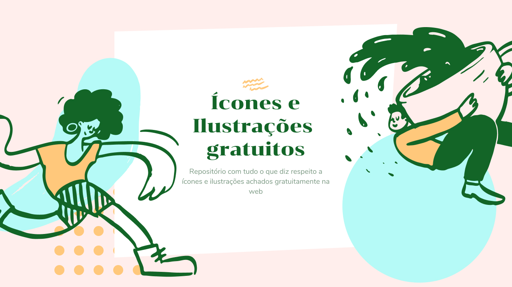

# Free Icons and Illustrations
Just like everyone who designs a website, always looking at those fucking sites with incredible illustrations and compositions, but without the slightest idea of how to find good resources to create something similar in my projects. Over time I found sites that made them available and icons for free and saved them in a folder on my browser.

However, just as one day I wished I had these resources to compose my interfaces, I believe that other developers and designers would also love to have access to a good collection to use at any time. That's why I'm creating this repository with all the links I found (and the ones I will find in the future) of icons of illustrations totally free. :)

I hope everything is very useful;) And if so, share the repository with colleagues and / or groups

## Illustrations
[storytale.io](https://storytale.io/)  
[Black illustrations](https://www.blackillustrations.com/)  
[Flow Lava](https://flowlava.club/)  
[Control](https://control.rocks/)  
[Stories by Freepik](https://stories.freepik.com/)  
[Blush](https://blush.design/)  
[404 illustrations](https://error404.fun/)  
[Blob Marker](https://www.blobmaker.app/)  
[Scribbles](https://www.scribbbles.design/)  
[Get Waves](https://getwaves.io/)  
[Karthik Srinivas](https://www.karthiksrinivas.in/)  
[Design.ai](https://designs.ai/graphicmaker/)  
[Smash Illustrations](https://usesmash.com/)  
[Undraw](https://undraw.co/)  
[Open Doodles](https://www.opendoodles.com/)  
[Stubborn Generator](https://stubborn.fun/)  
[freellustrations](https://freellustrations.com/)  
[Fresh Folk](https://fresh-folk.com/)  
[Glaze](https://www.glazestock.com/)  
[Abstrakt](https://www.abstrakt.design/)  
[Mixkit Art](https://mixkit.co/free-stock-art/)  
[Ouch](https://icons8.com/illustrations)  
[DrawKit](https://www.drawkit.io/)  
[Sapiens](https://sapiens.ui8.net/)  
[Open Peeps](https://www.openpeeps.com/)  
[Mega Doodles Pack](https://github.com/MariaLetta/mega-doodles-pack)  
[Growww](https://growwwkit.com/illustrations/phonies/)  
[Illustrations](https://illlustrations.co/)  
[Vector Creator](https://icons8.com/vector-creator/)  
[Delesign](https://delesign.com/)  
[Paper Illustrations](https://iconscout.com/paper-illustrations)  
[Whoosh! Illustration Kit](https://www.ls.graphics/illustrations/whoosh)  
[404 illustrations by kapwing](https://www.kapwing.com/404-illustrations)  
[Lukasadam](https://lukaszadam.com/illustrations)  
[Manypixels Illustration Gallery](https://www.manypixels.co/gallery/)  
[IRA Design](https://iradesign.io/)  
[Absurd Design](https://absurd.design/)  
[Humaaans](https://www.humaaans.com/)  
[Toy Faces](https://amritpaldesign.com/toy-faces)  
[Kukla Kit](https://www.kukla-kit.com/)  
[Construtor de Ilustrações](https://itg.digital/)  
[Ara Illustration](https://www.aracreator.com/)
## Icons
[css.gg](https://css.gg/)  
[Icon Icons](https://icon-icons.com/)  
[Freepik](https://br.freepik.com/)  
[Ikonate](https://ikonate.com/)  
[Tilda Icons](https://tilda.cc/free-icons/)  
[Remix Icon](https://remixicon.com/)  
[freeicons.io](https://freeicons.io/)  
[Iconfinder](https://www.iconfinder.com/free_icons)  
[Icons8 Icons](https://icons8.com.br/icons)  
[Feather](https://feathericons.com/)  
[Iconscout](https://iconscout.com/)  
[Eva Icons](https://akveo.github.io/eva-icons/)  
[Noun Project](https://thenounproject.com/)  
[Ionicons](https://ionicons.com/)  
[Font Awesome](https://fontawesome.com/)  
[Boxicons](https://boxicons.com/)  
[shape.so](https://shape.so/)  
[Heroicons](https://heroicons.dev/)  
[Iconsvg](https://iconsvg.xyz/)  
[Streamline UX](https://www.streamlineicons.com/ux/)  
[Steamline Free](https://www.streamlineicons.com/free/)  
[Flaticon](https://www.flaticon.com/packs)  
[Tabler Icons](https://tablericons.com/)  
[Newsbi Icon Pack](https://gumroad.com/l/lfdy)  
[Line Awesome](https://icons8.com/line-awesome)  

## websites to find free resources
[Evernote Design](https://www.evernote.design/)  
[Newsletter UI Lab](https://uilab.com.br/)  
[Design Resources](https://www.designresourc.es/)  
[Bookmarks.design](https://www.bookmarks.design/)

