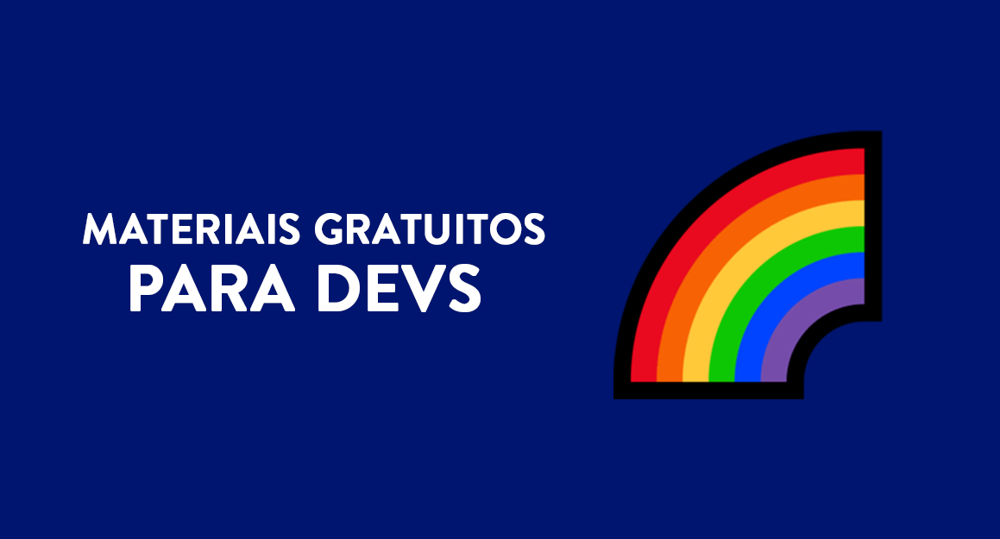

<h1 align="center">
  
</h1>

> When I'm about to start to develop or coding a website, there's always a doubt: <i>Which resources I must to use and where I can find them?</i>
> Then, because of this question, I created this repository as a answer to it, it's more than a plenty of links, that's a selection of what we judge as the some of the better ways to learn online for free.

## 📕 Index

📌 [Images](../materiais-gratuitos-para-sites.md#-imagens) 
📌 [Illustrations and SVG](../materiais-gratuitos-para-sites.md#-ilustrações-e-vetores) 
📌 [Emojis](../materiais-gratuitos-para-sites.md#-emojis) 
📌 [Color palette](../materiais-gratuitos-para-sites.md#-paletas-de-cores) 
📌 [Fonts and Icon Fonts](../materiais-gratuitos-para-sites.md#-fontes-e-fontes-de-ícones) 
📌 [Icons](../materiais-gratuitos-para-sites.md#-ícones) 
📌 [Animations e Gifs](../materiais-gratuitos-para-sites.md#-animações-e-gifs) 
📌 [Logos](../materiais-gratuitos-para-sites.md#-logos) 

---

## 📕 Index

📌 [Books](../materiais-gratuitos-para-estudos.md#-livros) 
📌 [Courses](../materiais-gratuitos-para-estudos.md#-cursos) 
📌 [Podcasts](../materiais-gratuitos-para-estudos.md#-podcasts) 
📌 [Websites and Blogs](../materiais-gratuitos-para-estudos.md#-sites-e-blogs) 

---

## 📕 Index

📌 [Develop Tools](../materiais-gratuitos-para-devs.md#-ferramentas-de-desenvolvimento) 
📌 [IDEs and Code editors](../materiais-gratuitos-para-devs.md#-ides-e-editores-de-código) 
📌 [Programming Languages](../materiais-gratuitos-para-devs.md#-linguagens-de-programação) 
📌 [Hosting](../materiais-gratuitos-para-devs.md#-hospedagem) 

---

## 📕 Index

📌 [Tools](../materiais-gratuitos-para-designers.md#-ferramentas)  

## 🌈 Contributors 

<table>
  <tr>
    <td align="center">
      <a href="https://github.com/iuricode">
         
        
          <b>Iuri Silva</b>
        
      </a>
    </td>
    <td align="center">
      <a href="https://github.com/walysonfelipe">
         
        
          <b><<!---->Waly></b>
        
      </a> 
    </td>
    <td align="center">
      <a href="https://github.com/joaomaranhao">
         
        
          <b>João Maranhão</b>
        
      </a> 
    </td>
    <td align="center">
      <a href="https://github.com/ff4LL">
         
        
          <b>Carlos Daniel</b>
        
      </a> 
    </td>
    <td align="center">
      <a href="https://github.com/reness0">
         
        
          <b>Renê Júnior</b>
        
      </a> 
    </td>

  
  </tr>
</table>

## ⛩ Be one of the contributors 

Do you want to make part of this project? Click [HERE](../CONTRIBUTING.md) e and read how to contribute. 

## ⚖ License

This projects is  licensed. Open the file [LICENSE](../LICENSE.md) for more details. 

## ℹ️ Project Info

