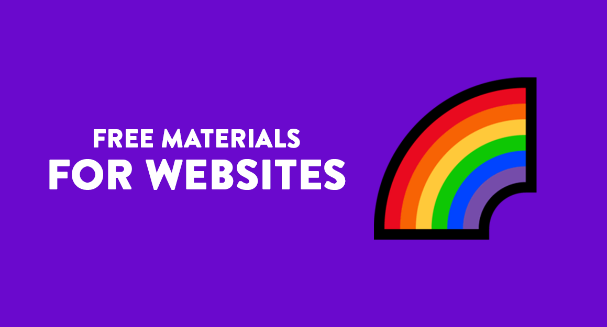

<h1 align="center">
  
</h1>

#### Mudar para português: <kbd></kbd>

#### Cambiar al español: <kbd></kbd>

#### 切換到英文: <kbd></kbd>

> When I'm about to start to develop or coding a website, there's always a doubt: <i>Which resources I must to use and where I can find them?</i>
> Then, because of this question, I created this repository as a answer to it, it's more than a plenty of links, that's a selection of what we judge as the some of the better ways to learn online for free.

## 📕 Index

📌 [Images](pages/free-materials-for-websites.en.md#-images) 
📌 [Illustrations and SVG](pages/free-materials-for-websites.en.md#-illustrations-and-svg) 
📌 [Emojis](pages/free-materials-for-websites.en.md#-emojis) 
📌 [Color palette](pages/free-materials-for-websites.en.md#-color-palette) 
📌 [Fonts and Icon Fonts](pages/free-materials-for-websites.en.md#-fonts-and-icon-fonts) 
📌 [Icons](pages/free-materials-for-websites.en.md#-icons) 
📌 [Animations e Gifs](pages/free-materials-for-websites.en.md#-animations-and-gifs) 
📌 [Logos](pages/free-materials-for-websites.en.md#-logos) 

---

## 📕 Index

📌 [Books](pages/free-materials-for-studies.en.md#-books) 
📌 [Courses](pages/free-materials-for-studies.en.md#-courses) 
📌 [Podcasts](pages/free-materials-for-studies.en.md#-podcasts) 
📌 [Websites and Blogs](pages/free-materials-for-studies.en.md#-websites-and-blogs) 

---

## 📕 Index

📌 [Developer Tools](pages/free-materials-for-devs.en.md#-developer-tools) 
📌 [IDEs and Code editors](pages/free-materials-for-devs.en.md#-ides-and-code-editors) 
📌 [Programming Languages](pages/free-materials-for-devs.en.md#-programming-languages) 
📌 [Hosting](pages/free-materials-for-devs.en.md#-hosting) 

---

## 📕 Index

📌 [Tools](pages/free-materials-for-designers.en.md#-tools)  

## 🌈 Contributors 

<table>
  <tr>
    <td align="center">
      <a href="https://github.com/iuricode">
         
        
          <b>Iuri Silva</b>
        
      </a>
    </td>
    <td align="center">
      <a href="https://github.com/walysonfelipe">
         
        
          <b><<!---->Waly></b>
        
      </a> 
    </td>
    <td align="center">
      <a href="https://github.com/joaomaranhao">
         
        
          <b>João Maranhão</b>
        
      </a> 
    </td>
    <td align="center">
      <a href="https://github.com/z3ox1s">
         
        
          <b>Carlos Daniel</b>
        
      </a> 
    </td>
    <td align="center">
      <a href="https://github.com/reness0">
         
        
          <b>Renê Júnior</b>
        
      </a> 
    </td>

  
  </tr>
</table>

## ⛩ Be one of the contributors 

Do you want to make part of this project? Click [HERE](CONTRIBUTING.en.md) and read how to contribute. 

## ⚖ License

This projects is  licensed. Open the file [LICENSE](LICENSE.en.md) for more details. 

## ℹ️ Project Info

