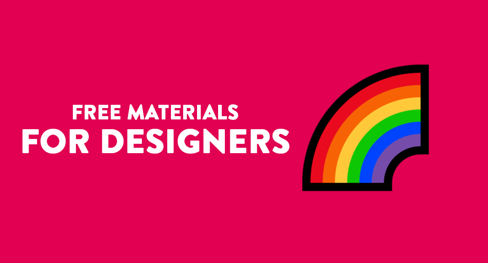

 [⬅ Back to the start ](../README.en.md)  

## 📕 Index 

📌 [Tools](#-tools)  

## 🔧 Tools

| Links      | 
| :----------: | 
| [Adobe XD](https://www.adobe.com/br/products/xd.html) | 
| [Awwwards](https://www.awwwards.com) | 
| [Bootstrap](https://www.getbootstrap.com/) | 
| [BuildBootstrap](https://buildbootstrap.com/) | 
| [Bulma CSS](https://bulma.io/) | 
| [Canva](https://www.canva.com/) | 
| [Colors and Fonts](https://www.colorsandfonts.com/) | 
| [Coolors](https://coolors.co/) | 
| [Cruip](https://cruip.com/) | 
| [CSS Effects Snippets](https://emilkowalski.github.io/css-effects-snippets/) | 
| [CSS Tricks](https://css-tricks.com/) |
| [Figma](https://www.figma.com/) | 
| [Flatui Color Picker](http://www.flatuicolorpicker.com/) | 
| [Font Flipper](https://fontflipper.com/) | 
| [FontPair](https://fontpair.co/) |
| [FontSpark](https://fontspark.app/) | 
| [Foundation](https://foundation.zurb.com/) | 
| [Framer](https://www.framer.com/) | 
| [FreeFrontEnd](https://freefrontend.com/) | 
| [Gravit Designer](https://www.designer.io) | 
| [Interfacer](https://interfacer.xyz/) | 
| [Interfaces.pro](https://interfaces.pro/) | 
| [Invision](https://www.invisionapp.com/) | 
| [Lottie](https://lottiefiles.com/) | 
| [Luna](https://github.com/OfficialMarinho/luna) | 
| [Material-UI](https://material-ui.com/) | 
| [Mockup](https://mockup.io/about/) | 
| [Nes.css](https://nostalgic-css.github.io/NES.css/) | 
| [Neumorphism](https://neumorphism.io/) | 
| [Normalize CSS](https://necolas.github.io/normalize.css/) | 
| [Pixilart](https://www.pixilart.com/draw) | 
| [PSD-To-CSS-Shadow](http://psd-to-css-shadows.com/) | 
| [Pure.css](https://purecss.io/) | 
| [Remove.bg](https://www.remove.bg/) | 
| [Sketch](https://www.sketch.com/) | 
| [Squoosh.app](https://squoosh.app/) | 
| [UI Gradients](https://uigradients.com/) | 
| [Whimsical](https://whimsical.com/) | 

 [⬆ Back to the index](#-index)  
