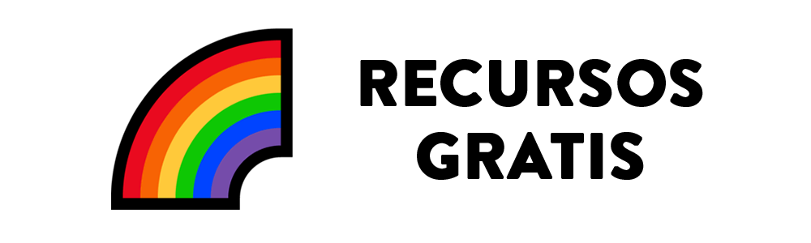
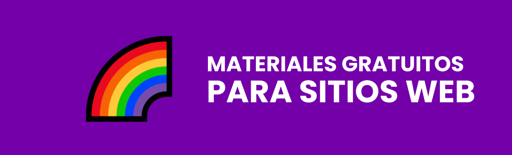
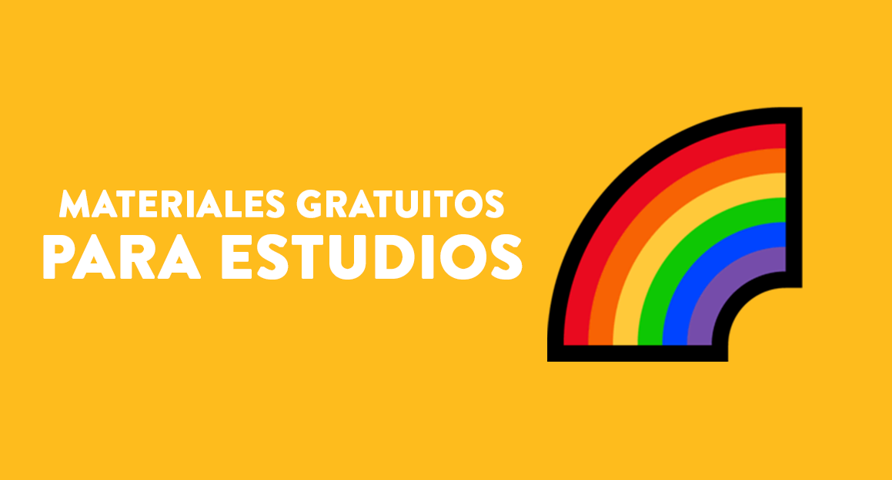
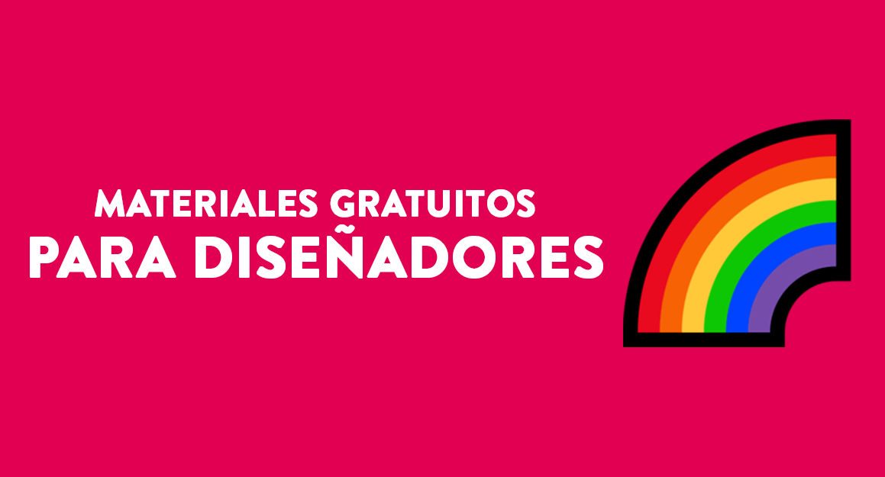

<h1 align="center">
  
</h1>

#### Mudar para português: <kbd></kbd>

#### Switch to english: <kbd></kbd>

> Cuando estoy a punto de comenzar a desarrollar o codificar un sitio web, siempre hay una duda: <i> ¿Qué recursos debo usar y dónde puedo encontrarlos?</i>
> Luego, debido a esta pregunta, creé este repositorio como respuesta, es más que un montón de enlaces, esa es una selección de lo que juzgamos como algunas de las mejores formas de aprender en línea de forma gratuita.

## 📕 Índice

📌 [Imagenes](pages/materiales-gratuitos-para-sitio-web.es.md#-imagenes) 
📌 [Ilustraciones y SVG](pages/materiales-gratuitos-para-sitio-web.es.md#-ilustraciones-y-svg) 
📌 [Emojis](pages/materiales-gratuitos-para-sitio-web.es.md#-emojis) 
📌 [Paleta de color](pages/materiales-gratuitos-para-sitio-web.es.md#-paleta-de-color) 
📌 [Fuentes y fuentes de iconos](pages/materiales-gratuitos-para-sitio-web.es.md#-fuentes-y-fuentes-de-iconos) 
📌 [Iconos](pages/materiales-gratuitos-para-sitio-web.es.md#-iconos) 
📌 [Animaciones y gifs](pages/materiales-gratuitos-para-sitio-web.es.md#-animaciones-y-gifs) 
📌 [Logos](pages/materiales-gratuitos-para-sitio-web.es.md#-logos) 

---

## 📕 Índice

📌 [Libros](page/materiales-gratuitos-para-estudios.es.md#-libros) 
📌 [Cursos](page/materiales-gratuitos-para-estudios.es.md#-cursos) 
📌 [Podcasts](page/materiales-gratuitos-para-estudios.es.md#-podcasts) 
📌 [Sitios web y blogs](page/materiales-gratuitos-para-estudios.es.md#-sitios-web-y-blogs) 

---

## 📕 Índice

📌 [Herramientas de desarrollo](pages/materiales-gratuitos-para-desarrolladores.es.md#-herramientas-de-desarrollo) 
📌 [IDEs y editores de código](pages/materiales-gratuitos-para-desarrolladores.es.md#-ides-y-editores-de-codigo) 
📌 [Lenguajes de programación](pages/materiales-gratuitos-para-desarrolladores.es.md#-lenguajes-de-programacion) 
📌 [Hospedaje](pages/materiales-gratuitos-para-desarrolladores.es.md#-hospedaje) 

---

## 📕 Índice

📌 [herramientas](pages/materiales-gratuitos-para-disenadores.es.md#-herramientas)  

 

## 🌈 Colaboradores 

<table>
  <tr>
    <td align="center">
      <a href="https://github.com/iuricode">
         
        
          <b>Iuri Silva</b>
        
      </a>
    </td>
    <td align="center">
      <a href="https://github.com/walysonfelipe">
         
        
          <b><<!---->Waly></b>
        
      </a> 
    </td>
    <td align="center">
      <a href="https://github.com/joaomaranhao">
         
        
          <b>João Maranhão</b>
        
      </a> 
    </td>
    <td align="center">
      <a href="https://github.com/ff4LL">
         
        
          <b>Carlos Daniel</b>
        
      </a> 
    </td>
    <td align="center">
      <a href="https://github.com/reness0">
         
        
          <b>Renê Júnior</b>
        
      </a> 
    </td>

  
  </tr>
</table>

## ⛩ Sea uno de los contribuyentes 

Quieres formar parte de este proyecto? Haga clic en [AQUÍ](./CONTRIBUTING.es.md) e y lea cómo contribuir. 

## ⚖ Licencia

Este proyecto tiene licencia. Abra el archivo [LICENCIA](./LICENSE.es.md) para obtener más detalles. 

## ℹ️ Información del proyecto

